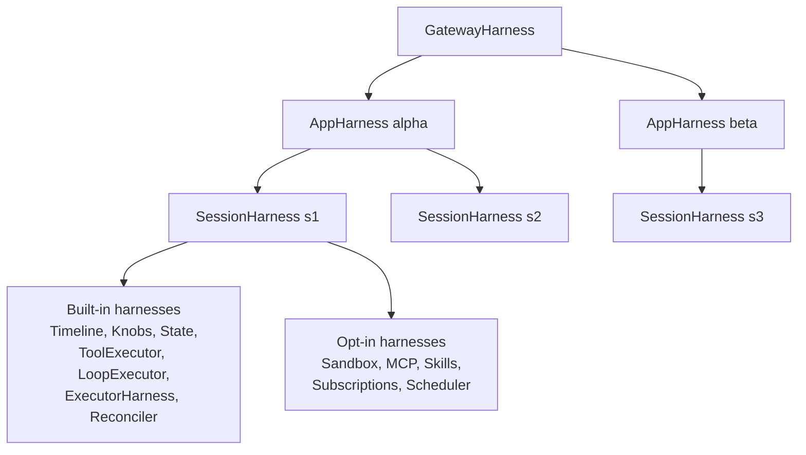
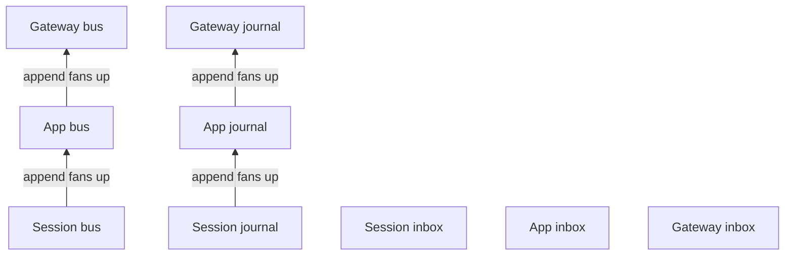
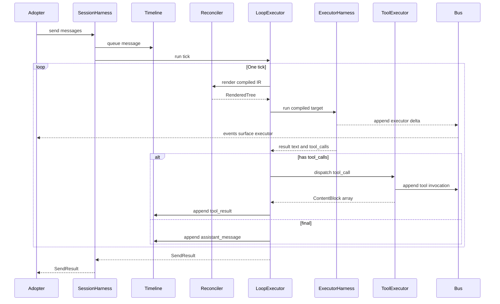
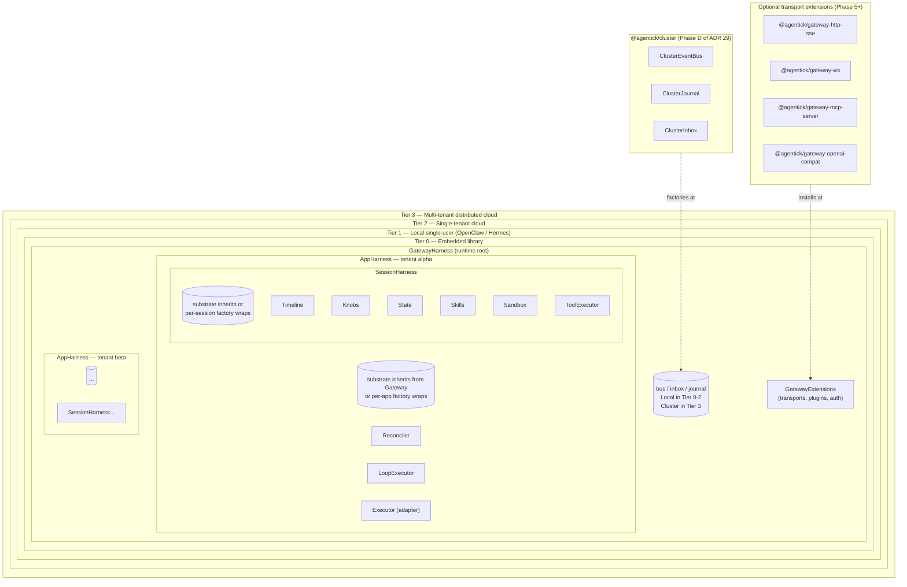
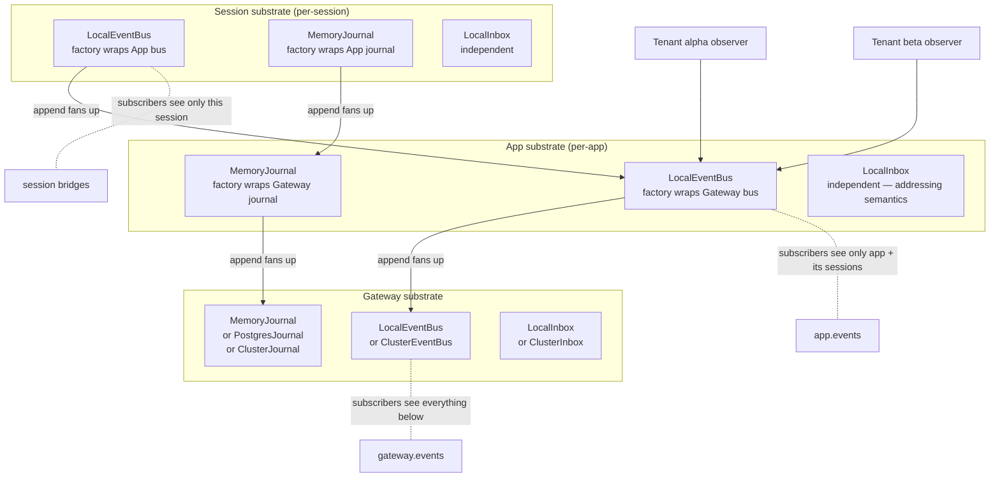
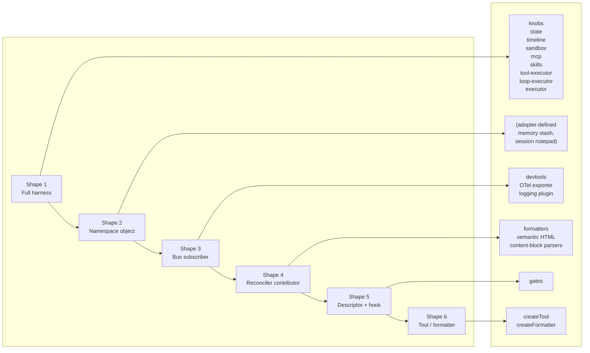
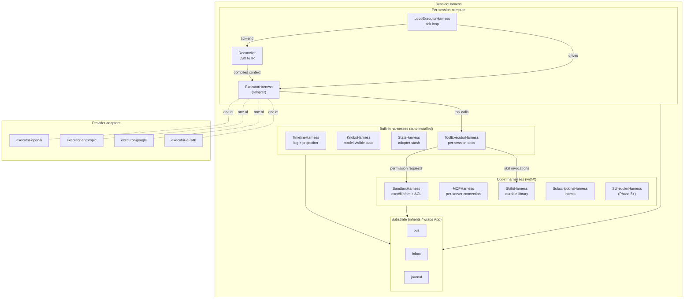

# Agentick v2 — Architecture Blueprint

**Status:** Synthesis Draft · last updated 2026-05-08

This blueprint synthesizes the v2 proposal set
(`harness-principle`, `compiled-spec`, `spec-package`, `compiler-harness`,
`renderer-harness`, `loop-executor`, `executor`, `runtime`, `cluster`,
`gateway`) into one navigable picture. It is a working document for the
author, future maintainers, integrators, and code agents working on the
implementation. It does not replace the source proposals — it indexes,
diagrams, and crystallizes them, and flags gaps that the proposals leave
open.

## Reading order

The numbered docs are sortable identifiers; the recommended reading
order is below. **`19-foundation.md` was added late and should be read
right after `01-harness-principle.md`** — it describes the substrate
every harness inherits from (operations, journal, bus, OTel projection)
and the rest of the blueprint sits on top of it.

**ADRs 26 + 27 are foundational and load-bearing.** Read them after
`19-foundation.md` and before any package-specific docs:

- `26-harness-api-shape.md` — everything-is-a-harness; uniform shape.
- `27-modular-built-ins.md` — built-ins are bundled, not privileged;
  same modular pattern for foundational and optional extensions; the
  augmentation model + per-harness layout convention. **Active
  architectural direction; non-negotiable for new v2 code.**

```
00-overview.md                    (this file)
01-harness-principle.md           the five protocol surfaces (read second)
19-foundation.md                  the substrate underneath (read third)
26-harness-api-shape.md           ADR 26 — harness as the single shape (foundational)
27-modular-built-ins.md           ADR 27 — bundled built-ins + augmentation (foundational)
02-data-model.md                  the wire shapes everything else exchanges
03-reconciler-harness.md            producer of RenderedTree (v2 ships @agentick/reconciler-react)
04-formatters.md                   semantic content → rendered content (pure functions, see ADR 22)
05-loop-executor.md               tick orchestration
06-executor-harness.md            RenderedTree → provider → result
07-tool-executor.md               handler dispatch
08-session-harness.md             identity, state, timeline, persistence
09-app-harness.md                 session lifecycle, cross-cutting
10-events-handlers-inbox.md       five-surface integration substrate
11-cluster.md                     optional distributed wrapper
12-gateway.md                     optional ingress wrapper
13-package-graph.md               who depends on whom; Effect-free line
14-state-tiers.md                 fiber tree / session-side / Scope / persistence
15-flows/                         end-to-end sequence diagrams
16-glossary.md                    every v2 term in one place
17-open-questions.md              deduped across all source docs
18-traceability.md                blueprint section → source proposal map
20-pluggability-charter.md        protocol-first principle in engineering terms
21-reconciler-implementation.md   low-level shape of @agentick/reconciler-react
                                  (host config, contributors, hook bridges)
```

## Annotation conventions

Throughout the blueprint:

- **`[V1-INHERITED]`** — v2 keeps the v1 shape (sometimes promoted, sometimes
  refined). The v1 file path is cited.
- **`[V1-REPLACED]`** — v2 replaces a v1 concept. Both old and new are named
  so readers can map their mental model.
- **`[GAP]`** — the source v2 proposals leave this undefined. The blueprint
  describes the surface area but does not invent a shape.
- **`[PLACEHOLDER]`** — the blueprint synthesizes a placeholder type or
  behavior from v1's existing shape, marked clearly as a starting point that
  needs sign-off, not a final decision.
- **`[PROPOSAL]`** — the blueprint takes a position on a contradiction or
  open question in the source proposals. Always pending sign-off.
- **`[SOURCE: doc.md §X]`** — direct citation to a source proposal.

These markers are also collected in `18-traceability.md`.

## The four pillars of v2

The architecture rests on four load-bearing decisions:

```
┌──────────────────────────────────────────────────────────────────┐
│ 1. THE HARNESS PRINCIPLE                                         │
│    Every meaningful layer is an addressable actor with five      │
│    integration surfaces: commands, inbox (typed messages),       │
│    lifecycle handlers, middleware, events.                       │
│                                                                  │
│ 2. THE SPEC FIREWALL                                             │
│    Anything crossing harness boundaries is JSON-shaped data.     │
│    Effect, React, SDK clients, renderer instances, closures —    │
│    none of these cross the wire.                                 │
│                                                                  │
│ 3. LIBRARY-FIRST RUNTIME                                         │
│    The runtime is in-process by default. Cluster and gateway     │
│    are optional wrappers, not architectural forks.               │
│                                                                  │
│ 4. REAL REACT, LIVING TREE                                       │
│    The reconciler harness is a living mounted application that        │
│    emits multiple artifacts (RenderedTree, rendered         │
│    string, rendered resource), not a one-shot compiler.          │
└──────────────────────────────────────────────────────────────────┘
```

If you only remember one thing, remember that the harness pattern is
fractal: every layer below has the same shape (commands / events /
interceptors / outcomes), and the same observability and testing strategy
applies to all of them.

## The harness stack at a glance

```
┌─────────────────────────────────────────────────────────────────┐
│                          Optional ingress                       │
│   ┌────────────────────────────────────────────────────────┐    │
│   │   @agentick/gateway   (HTTP / WS / SSE / RPC adapters) │    │
│   └────────────────────────────────────────────────────────┘    │
└────────────────────────────┬────────────────────────────────────┘
                             │
┌────────────────────────────┴────────────────────────────────────┐
│                       Optional topology wrapper                 │
│   ┌────────────────────────────────────────────────────────┐    │
│   │   @agentick/cluster   (sharding, activation, fan-out)  │    │
│   └────────────────────────────────────────────────────────┘    │
└────────────────────────────┬────────────────────────────────────┘
                             │
┌────────────────────────────┴────────────────────────────────────┐
│                     Library-first runtime core                  │
│                                                                 │
│   ┌──────────────────────────────────────────────────────────┐  │
│   │ App harness                                              │  │
│   │   createSession · runOnce · getSession · listSessions    │  │
│   │   ┌────────────────────────────────────────────────────┐ │  │
│   │   │ Session harness   (one instance per session)       │ │  │
│   │   │   send · dispatch · render · append · spawn ·      │ │  │
│   │   │   abort · pause · resume · hibernate · restore     │ │  │
│   │   │   ┌──────────────────────────────────────────────┐ │ │  │
│   │   │   │ Loop executor   (one instance per execution) │ │ │  │
│   │   │   │   runExecution · abort                       │ │ │  │
│   │   │   │   ┌──────────────────────┬───────────────┐   │ │ │  │
│   │   │   │   ▼                      ▼               │   │ │ │  │
│   │   │   │ reconciler harness      Executor harness      │   │ │ │  │
│   │   │   │ (mount, compile,   (project, execute,    │   │ │ │  │
│   │   │   │  render, snapshot)  normalize, run)      │   │ │ │  │
│   │   │   │   │                    │                 │   │ │ │  │
│   │   │   │   ▼                    ▼                 │   │ │ │  │
│   │   │   │ Formatter harness   Tool executor harness │   │ │ │  │
│   │   │   │ (semantic content  (dispatch, validate,  │   │ │ │  │
│   │   │   │  → rendered)        confirm)             │   │ │ │  │
│   │   │   └──────────────────────────────────────────┘   │ │ │  │
│   │   └───────────────────────────────────────-──────────┘ │ │  │
│   └──────────────────────────────────────────-─────────────┘ │  │
└──────────────────────────────────────────────────────────────┘──┘
```

Eight harnesses (App, Session, Loop, React, Renderer, Executor, Tool
Executor — plus arguably the Cluster/Gateway wrappers themselves). Each
one implements the same four-surface pattern.

## What changed from v1

```
v1 concept                          v2 concept
──────────────────────────────────────────────────────────────────────
COM (1268 LOC mutation API)         GONE — no intermediate object model
RenderedTree (Map-based,       RenderedTree (JSON-shaped IR
  contains live Renderer +            with FormatterRef + JSON declarations
  ExecutableTool refs)                only)
COMInput (model adapter input)      GONE — collapsed into RenderedTree
EngineInput                         GONE — collapsed into RenderedTree
Tool.audience field                 ToolDeclaration.exposure[]
SectionEntry.intent (closed enum)   GONE — `id` + `title` + content suffice
EphemeralEntry / EphemeralPosition  Compile/runtime-only transient render
                                      input; not a distinct compiled kind
StructureRenderer                   Formatter harness + runtime projection
                                      (split into two responsibilities)
ExecutionRunner.transformCompiled   Loop / executor interceptors + replace
ExecutionRunner.executeToolCall     Tool executor before-dispatch interceptor
LifecycleCallbacks.onTickStart/...  Session interceptors on send/render/...
EventEmitter on session             Unified PubSub<ProtocolEvent>
~43 raw stream event types          Wrapped in EventEnvelope with
                                      surface / name / phase / outcome
ModelOutput (provider-flavored)     ExecutionResult (canonical, success-
                                      only) wrapped in ExecutorTerminal
Session = sharded entity (by        Session = library object first;
  default, distributed-by-default)    cluster wraps it for distribution
```

`13-package-graph.md` and `02-data-model.md` go deeper.

## Glossary in one paragraph

A **harness** is a layer with four surfaces (commands, events,
interceptors, outcomes). A **command** is a typed request to do work. An
**event** is a past-tense notification. An **interceptor** participates in
command execution and may proceed/defer/veto/replace. An **outcome** is
the terminal verdict (`succeeded`/`failed`/`canceled`/`vetoed`/`replaced`/
`deferred`). The **RenderedTree** is the JSON-shaped IR produced by
the **reconciler harness** and consumed by the **loop executor** which calls
the **executor harness** for provider runs and the **tool executor
harness** for handler dispatch. **Renderer** is a separate harness that
turns semantic content into rendered content (markdown/XML/etc.). The
**session harness** owns identity and timeline; the **app harness** owns
sessions; **cluster** and **gateway** are optional wrappers. The **spec
firewall** says anything crossing a harness boundary must be JSON-shaped.

For the full glossary with v1 cross-references, see `16-glossary.md`.

## How to use this blueprint

- **Designing a feature:** find the harness it belongs to, read that doc
  plus `01-harness-principle.md`, then check the relevant flow diagram in
  `15-flows/`. Search `17-open-questions.md` for nearby unresolved items.
- **Implementing a harness:** the per-harness doc has commands, events,
  interceptors, outcomes, and known gaps. Use `02-data-model.md` for the
  exact types it consumes and produces. Cross-check `13-package-graph.md`
  for what depends on it.
- **Reviewing v2 architectural changes:** start at this overview, then
  `01-harness-principle.md`, then the specific harness doc. The
  `[V1-REPLACED]` markers anchor each move.
- **Triaging an open question:** `17-open-questions.md` is the single
  consolidated list. Each item references the source doc.

## Status of this blueprint

This is a living document like the source proposals. Sections are marked
`Status: Synthesized`, `Status: Synthesized with placeholders`, or
`Status: Gap-noted` so readers can tell at a glance whether a section is
crystallized, awaiting sign-off, or known to be incomplete.

---

## Focused single-concern diagrams (WORK IN PROGRESS)

> **Why these instead of one big diagram.** The earlier nested
> diagrams (kept below as supplementary) tried to show hierarchy,
> substrate composition, deployment tiers, and extension shapes all
> at once. The Russian-doll nesting in particular implied
> _containment_ between tiers when they're actually _alternative
> deployment shapes for the same harness graph_. These focused
> diagrams each answer ONE question, with minimal nesting. The
> tradeoff: you need four of them to see the whole picture, but
> each one is legible on its own.
>
> Still WIP. Prose ADRs (`01` through `32`) remain source of truth.

### A. The harness tree — who hosts whom

Answers: "what's the parent-child relationship in the harness graph?"



Reading guide:

- One Gateway hosts many Apps. Multi-app is structural, not a
  multi-tenancy feature — same gateway hosts unrelated agent
  configurations.
- One App hosts many Sessions. Sessions are units of execution.
- Per-session harnesses (built-in or opt-in) are owned by the
  session, not the app. Same session → same harness instances.
- The single App alpha → Sessions sub-tree is fully expanded; App
  beta's omitted for clarity (same shape).

### B. Substrate composition — fan-in writes, isolated reads

Answers: "how do bus / inbox / journal compose across levels?"



Reading guide:

- **Bus and journal fan in.** Events appended at Session level also
  appear at App and Gateway level. Subscribers at any level see
  events from their scope and below.
- **Inbox does NOT fan in.** Addresses are unique per inbox; fanning
  in would break delivery semantics.
- Fan-in is a factory choice. Default behavior is "share the
  parent's instance" (no fan-in needed because there's one bus).
  Factories at substrate slots wrap the parent to produce per-level
  isolation — useful for per-session multi-tenancy.

### C. Extension shape spectrum (table form)

Answers: "what should I build when I want to extend agentick?"

| #   | Shape                  | Cost                 | Pick when...                                                     | Reference                                                |
| --- | ---------------------- | -------------------- | ---------------------------------------------------------------- | -------------------------------------------------------- |
| 1   | Full harness           | high (~600-1000 LOC) | audit envelopes, swappable backend, cluster routing, persistence | `knobs`, `state`, `timeline`, `sandbox`, `mcp`, `skills` |
| 2   | Namespace object       | mid (~100-200 LOC)   | shared state, no audit needed                                    | (adopter-defined)                                        |
| 3   | Pure bus subscriber    | low (~3-30 LOC)      | observe events, write to a destination                           | `devtools`, OTel exporter, logging                       |
| 4   | Reconciler contributor | low-mid              | render-time output transform                                     | `formatters`, semantic HTML, content blocks              |
| 5   | Descriptor + hook      | low                  | declarative composition over a primitive                         | `gates` (over knobs)                                     |
| 6   | Tool / formatter       | low                  | single function or transform                                     | adopter `createTool`s                                    |

Cost is rough. The "Pick when..." column is the decision criterion
— if multiple apply, pick the shape that matches the strongest one.
Full reasoning + worked examples in ADR 32.

### D. Deployment tiers (table form)

Answers: "what changes when I deploy in tier X vs tier Y?"

| Tier | Use case                 | Substrate impl                                   | Extensions you install                                               | Example                                           |
| ---- | ------------------------ | ------------------------------------------------ | -------------------------------------------------------------------- | ------------------------------------------------- |
| 0    | Embedded library         | `LocalEventBus` + `MemoryJournal` + `LocalInbox` | none                                                                 | tests, CLIs, scripts                              |
| 1    | Local single-user agent  | local + `SQLiteJournal` (when durable)           | sandbox, MCP, scheduler, skills, connectors (Telegram, iMessage)     | OpenClaw / Hermes class                           |
| 2    | Single-tenant cloud      | local or single-node durable (`PostgresJournal`) | transports (HTTP/WS/SSE), auth, rate limit                           | hosted agent for one team                         |
| 3    | Multi-tenant distributed | `@agentick/cluster` substrate                    | transports + auth + tenant routing + per-session substrate factories | production SaaS, gateway fleet fronting a cluster |

**The harness shape is invariant across all four tiers.** What
changes: substrate factories at Gateway slots, and which extensions
are installed. Adopter code at the app/session level is identical
between Tier 0 and Tier 3.

### E. Data flow — one session.send round trip

Answers: "what happens when an adopter calls `session.send(...)`?"



Reading guide:

- Streaming deltas (`Ex-->>Bus`) fan out to any subscriber, including
  the adopter via `session.events()` — that's the live token stream.
- The tool-dispatch branch runs once per tick when the model emits
  tool calls. Real model loops can emit N tool calls per tick which
  all dispatch in parallel; this diagram only shows the single-tool
  case for legibility.
- After tool dispatch, the loop re-renders the JSX (the next tick's
  `LE->>Rec: render`) — that's how mid-conversation state changes
  reach the model.

---

## Supplementary diagrams (older drafts — kept for reference)

> **Caveat.** These are the original nested drafts produced 2026-06-07.
> They try to show too much at once and are harder to follow than the
> focused diagrams above. Kept here so the iteration history is visible.
> If something in the focused diagrams above is wrong or ambiguous,
> cross-check against the prose ADRs first; consult these only as a
> last-resort visual aid.
>
> **Known visualization concerns** (the diagram author flagged these):
>
> - The hierarchy diagram nests four tiers as a Russian doll, which is
>   visually misleading — they're alternative deployment shapes for the
>   same harness, not enclosing scopes.
> - The substrate composition diagram implies factory-vs-instance is
>   always the choice; in reality most adopters pass instances and
>   only reach for factories for per-session isolation.
> - The session anatomy diagram lists "auto-installed" vs "opt-in"
>   harnesses as if the line is sharp; it's actually a policy choice
>   per session-extensions cascade and may shift with Phase 5+ work.
> - Several arrow directions on the substrate diagram represent
>   logical "fan-in" rather than literal Effect data flow.
>
> Iterating on these is worthwhile; treating them as canonical is
> premature.

### 1. Harness hierarchy + deployment tiers



### 2. Substrate composition — fan-in writes, isolated reads



### 3. Extension shape spectrum (per ADR 32)



### 4. Inside a Session — the runtime anatomy



### 5. Data flow — one session.send round trip


### Where the diagrams need rework

If we're committing them as work-in-progress, here are concrete
items to come back to:

1. **Tier-nesting metaphor.** Russian-doll subgraphs imply containment.
   Better visualisation: a single Gateway frame with FOUR rendering
   modes shown side-by-side (one per tier) so the reader sees "same
   harness, different deployment context."
2. **Substrate fan-in arrows.** Need a key explaining "logical fan-in"
   vs literal Effect data flow. Bus subscribers don't see parent
   events — only events appended at their scope or below.
3. **Extension spectrum.** The horizontal-shape diagram doesn't really
   show _cost_ or _when to pick_. A radar/quadrant chart (audit need
   vs persistence need) might communicate the decision better than a
   linear ordering.
4. **Session anatomy.** "Built-in" vs "opt-in" is a Phase 4 statement;
   when the SessionExtension cascade ships (ADR 26 Step 8), the line
   blurs. Worth re-drawing then.
5. **Sequence diagram.** Doesn't show the per-tick reconciler-after-
   tool-result re-render loop accurately — the model can call N
   tools per tick which all dispatch in parallel, then the loop
   re-renders before the next tick. Current diagram implies tool
   dispatch happens inside the same tick the model emitted them
   from.

Treat these as a backlog. **Source of truth remains the prose ADRs**
(`01` through `32`) plus `V1-PARITY-TRACKER.md` and
`V1-GATEWAY-PARITY-TRACKER.md` for v1 → v2 disposition.
