# 13 — Package Graph

**Status:** Synthesized · refined 2026-05-08 (naming pattern locked)
`[SOURCE: spec-package.md, runtime.md, compiler-harness.md, executor.md, cluster.md, gateway.md]`

This doc is the dependency map of the v2 monorepo and the rules for who
can depend on whom. It enforces the **spec firewall** (browser-safe
contract layer at the bottom) and the **library-first** runtime
(distribution wrappers above).

## The naming pattern

Packages follow a substrate-agnostic-contract + per-substrate-impl pattern.
Each pluggable component has a **contract** (in spec) and one or more
**implementations**:

```
Pluggable component       Contract (in spec)               Implementations
──────────────────────────────────────────────────────────────────────────
Reconciler harness          spec/protocol/compiler.ts        @agentick/reconciler-react
                                                            (future: @agentick/compiler-vue, ...)

Formatter harness          spec/protocol/renderer.ts        @agentick/formatter-markdown*
                                                           @agentick/formatter-xml*
                                                           @agentick/formatter-text*
                                                           @agentick/formatter-json*
                                                           (* = ship inside compiler-react in v2;
                                                              split out only if needed)

Executor harness          spec/protocol/executor.ts        @agentick/executor-anthropic
                                                           @agentick/executor-openai
                                                           @agentick/executor-google
                                                           @agentick/executor-ai-sdk
                                                           @agentick/executor-mock

Persistence backend       spec/protocol/persistence.ts     @agentick/persistence-memory
                                                           @agentick/persistence-sqlite
                                                           @agentick/persistence-postgres
                                                           @agentick/persistence-redis

Sandbox provider          spec/protocol/sandbox.ts         @agentick/sandbox-local
                          @agentick/sandbox (helpers)      @agentick/sandbox-docker
                                                           @agentick/sandbox-bwrap
                                                           @agentick/sandbox-remote

Client SDK                                                 @agentick/client-react   ← v1 @agentick/react renamed
                          @agentick/client (transport)    @agentick/client-tui      ← v1 @agentick/tui renamed
                                                           @agentick/client-devtools ← v1 @agentick/devtools renamed
                                                           (future: client-angular, client-vue)

Server transport                                           @agentick/server-express  ← v1 @agentick/express renamed
                          @agentick/gateway (core)         (future: server-fastify, server-grpc)
                                                           @agentick/server-* per protocol
```

The pattern: **package name tells you exactly what kind of component it
is and which substrate.** Compare v1's flat naming where `@agentick/react`
ambiguously meant either "client hooks" or "JSX compiler" depending on
context; v2 names it.

## Renaming summary (v1 → v2)

```
v1 name                  v2 name                           Reason
──────────────────────────────────────────────────────────────────
@agentick/react          @agentick/client-react            client-side hooks; aligns with client-* namespace
@agentick/express        @agentick/server-express          server transport; aligns with server-* namespace
@agentick/tui            @agentick/client-tui              client SDK for TUIs
@agentick/devtools       @agentick/client-devtools         client UI for debugging
@agentick/kernel         (folded into runtime + shared)    BaseHarness replaces Procedure system
@agentick/openai         @agentick/executor-openai         executor harness implementation
@agentick/google         @agentick/executor-google         same
@agentick/ai-sdk         @agentick/executor-ai-sdk         same
(no v1 equivalent)       @agentick/reconciler-react          NEW v2 — JSX reconciler harness implementation
(no v1 equivalent)       @agentick/runtime                 NEW v2 — central runtime (replaces parts of @agentick/core)
(no v1 equivalent)       @agentick/cluster                 NEW v2 — optional distributed wrapper
(no v1 equivalent)       @agentick/persistence-{...}       NEW v2 — pluggable journal backends
@agentick/core           (split + retired)                 see Migration section
@agentick/shared         @agentick/shared                  slimmed (wire types moved to @agentick/spec)
@agentick/spec           @agentick/spec                    NEW v2 (wire types + protocol contracts)
@agentick/gateway        @agentick/gateway                 unchanged (already correctly named)
@agentick/sandbox        @agentick/sandbox                 unchanged
@agentick/sandbox-*      @agentick/sandbox-*               unchanged
@agentick/mcp            @agentick/mcp                     unchanged
```

## Layered package graph

```mermaid
graph TD
  subgraph applications["Applications"]
    appCode["user app code"]
  end

  subgraph wrappers["Optional topology wrappers (server-side)"]
    CL["@agentick/cluster"]
  end

  subgraph ingress["Optional ingress (server-side)"]
    GW["@agentick/gateway"]
    SE_EXP["@agentick/server-express"]
    SE_FA["@agentick/server-fastify"]
    SE_GRPC["@agentick/server-grpc"]
  end

  subgraph framework["Framework layer (server-side)"]
    RT["@agentick/runtime"]
    SBX["@agentick/sandbox"]
    MCP["@agentick/mcp"]
    PER_PG["@agentick/persistence-postgres"]
    PER_RD["@agentick/persistence-redis"]
    PER_SQL["@agentick/persistence-sqlite"]
    PER_MEM["@agentick/persistence-memory"]
  end

  subgraph compilers["Compiler implementations (server-side)"]
    CR["@agentick/reconciler-react"]
  end

  subgraph adapters["Executor adapters (server-side)"]
    EX_AN["@agentick/executor-anthropic"]
    EX_OAI["@agentick/executor-openai"]
    EX_GG["@agentick/executor-google"]
    EX_AISDK["@agentick/executor-ai-sdk"]
    EX_MOCK["@agentick/executor-mock"]
  end

  subgraph clientSDKs["Client SDKs (browser-safe)"]
    CLIENT["@agentick/client"]
    C_REACT["@agentick/client-react"]
    C_TUI["@agentick/client-tui"]
    C_DT["@agentick/client-devtools"]
  end

  subgraph foundation["Foundation"]
    SPEC["@agentick/spec"]
    SHARED["@agentick/shared"]
  end

  appCode --> GW
  appCode --> RT
  appCode --> CLIENT
  appCode --> C_REACT

  GW --> RT
  GW --> SPEC
  SE_EXP --> GW
  SE_FA --> GW
  SE_GRPC --> GW

  CL --> RT
  CL --> SPEC

  RT --> SPEC
  RT --> SHARED
  RT --> CR

  CR --> SPEC

  SBX --> SPEC
  MCP --> SPEC
  PER_PG --> SPEC
  PER_RD --> SPEC
  PER_SQL --> SPEC
  PER_MEM --> SPEC

  EX_AN --> SPEC
  EX_OAI --> SPEC
  EX_GG --> SPEC
  EX_AISDK --> SPEC
  EX_MOCK --> SPEC

  CLIENT --> SPEC
  CLIENT --> SHARED
  C_REACT --> CLIENT
  C_TUI --> CLIENT
  C_DT --> CLIENT

  SHARED --> SPEC
```



## Package roster and roles

| Package | Role | Browser-safe? | Effect dep? | Status |
| --- | --- | --- | --- | --- |
| `@agentick/spec` | Wire types + protocol interfaces + JSON Schema artifacts | yes | no | new in v2 |
| `@agentick/shared` | Cross-package utilities (extractText, identity, model catalog, errors) | yes | no | `[V1-REFINED]` (slimmed) |
| `@agentick/reconciler-react` | Reconciler harness implementation (JSX → RenderedTree). React reconciler + JSX runtime + components + hooks + built-in renderers. | no | no (Effect-free) | new in v2 |
| `@agentick/client` | Transport-side client core; consumes spec types | yes | no | `[V1-INHERITED, REFINED]` |
| `@agentick/client-react` | Pure React hooks for browser apps consuming a session | yes | no | `[V1-RENAMED]` from `@agentick/react` |
| `@agentick/client-tui` | Ink-based TUI client (uses client-react hooks under the hood) | no (Node) | yes | `[V1-RENAMED]` from `@agentick/tui` |
| `@agentick/client-devtools` | Browser UI for DevTools (consumes DevTools event stream via transport) | yes | no | `[V1-RENAMED]` from `@agentick/devtools` |
| `@agentick/runtime` | App harness, session harness, loop executor, tool executor (default impls), BaseHarness, MemoryJournal, LocalInbox, LocalEventBus | no | yes | `[V1-REPLACED]` for `@agentick/core` runtime parts |
| `@agentick/sandbox` | Sandbox component, types, edit utilities (helper package; not a provider impl) | partial | mixed | `[V1-INHERITED]` |
| `@agentick/sandbox-local`, `-docker`, `-bwrap`, `-remote` | Sandbox provider implementations | no | yes | `[V1-INHERITED]` |
| `@agentick/mcp` | MCP server + client + JSX components | no | yes | `[V1-INHERITED]` |
| `@agentick/persistence-{memory,sqlite,postgres,redis}` | Persistence backends (OperationJournal implementations) | no | yes | new in v2 (Postgres existed, refactored) |
| `@agentick/executor-{anthropic,openai,google,ai-sdk,mock}` | LanguageModelExecutor implementations | no | yes | `[V1-RENAMED + REFACTORED]` from v1 adapters |
| `@agentick/cluster` | Cluster routing + supervisor wrapper (`@effect/cluster` integration) | no | yes (+ `@effect/cluster`) | new in v2 |
| `@agentick/gateway` | Ingress base — typed message bus to harness commands | no | yes | `[V1-INHERITED, REFINED]` |
| `@agentick/server-{express,fastify,grpc,unix-socket,local}` | Transport adapter implementations | no | yes | `[V1-RENAMED]` (express was `@agentick/express`); rest mostly new |

`partial` browser-safe means "depending on which APIs you import."

## The spec firewall

```
                ╔══════════════════════════════════╗
                ║       @agentick/spec             ║   ← zero-dep, types-only
                ║  (data + protocol interfaces)    ║      browser-safe
                ╚══════════════════════════════════╝
                       ▲                  ▲
            depends on │                  │ depends on
         ───────────────┐              ┌───────────────
    @agentick/client    │              │  @agentick/runtime
    (browser-safe)      │              │  (server-side)
                        │              │
         everything      │              │ everything
         crossing        │              │ crossing
         the boundary    │              │ the boundary
         is JSON-shaped  │              │ is JSON-shaped
         spec data       │              │ spec data
```

**The spec firewall rule**: anything that crosses a harness boundary
must be a value defined in `@agentick/spec`. No Effect refs, no React
fibers, no provider SDK clients, no live renderer instances, no
closures.

This rule is what lets `@agentick/reconciler-react` stay Effect-free (it
only sees spec types) and what lets the runtime swap implementations
behind the boundary without browser code knowing.

## Effect-free vs Effect-bearing line

```
Effect-free packages (browser-safe, no Effect dep):
  @agentick/spec
  @agentick/shared
  @agentick/reconciler-react        ← EFFECT-FREE; pure React + spec types
  @agentick/client
  @agentick/client-react
  @agentick/client-devtools

Effect-bearing packages (server-side):
  @agentick/runtime
  @agentick/devtools-recorder     (server-side recording infra; not the UI)
  @agentick/sandbox-*
  @agentick/mcp
  @agentick/persistence-*
  @agentick/executor-*
  @agentick/cluster
  @agentick/gateway
  @agentick/server-*
  @agentick/client-tui            (Node-only; uses Ink)
```

Note: `@agentick/reconciler-react` is Effect-free even though it's
server-side. The runtime imports compiler-react and bridges to Effect at
the BaseHarness boundary; compiler-react itself is pure React + spec.

## Dependency rules

```
Allowed:
  app code → any framework or wrapper package
  framework package → spec, shared, other framework, browser-safe (read-only)
  browser-safe package → spec, shared
  spec → (nothing)
  shared → spec
  cluster → runtime, spec
  gateway → runtime, spec, server-* (transport impls)
  client-* → client, spec, (UI deps)
  runtime → spec, shared, compiler-react

Forbidden:
  spec → anything
  shared → runtime, compiler-react
  compiler-react → runtime, gateway, cluster (Effect-free!)
  client-react → runtime, server-*
  any browser-safe → any Effect-bearing
```

## What lives where

### `@agentick/spec`

```
src/
  version.ts                     SPEC_VERSION constant
  data/
    compiled-structure.ts        RenderedTree, ContextSpec
    entries.ts                   MessageEntry, SectionEntry
    declarations.ts              ToolDeclaration, ResourceDeclaration, OutputDeclaration, MCPDeclaration
    content-blocks.ts            ContentBlock taxonomy + guards
    media-source.ts              MediaSource union + guards
    semantic-node.ts             SemanticNode, SemanticType, SemanticMetadata
    execution-result.ts          ExecutionResult, ExecutorTerminal, LanguageModelExecutionResult, ToolCall
    execution-target.ts          ExecutionTarget, LanguageModelTarget, TargetCapabilities
    execution-deltas.ts          ExecutorDelta, RenderDelta
    events.ts                    EventEnvelope, ProtocolEvent, EventQuery, NameQuery, EventSurface
    messages.ts                  MessageEnvelope, MessageAck, MessageHandler signatures
    outcomes.ts                  CommandOutcome, HandlerVerdict
    channels.ts                  ChannelEvent, FrameworkChannels, payloads
    timeline.ts                  TimelineEntry
    knobs.ts                     KnobDeclaration, KnobState (placeholders)
    subscriptions.ts             SubscriptionIntent (placeholders)
    standard-schema.ts           inlined StandardSchemaV1
  protocol/
    compiler.ts                  ReconcilerProtocol + I/O types (the contract)
    renderer.ts                  FormatterProtocol + I/O types
    loop-executor.ts             LoopExecutorProtocol + I/O types
    executor.ts                  ExecutorProtocol + I/O types
    tool-executor.ts             ToolExecutorProtocol + I/O types
    session-harness.ts           SessionHarnessProtocol + I/O types
    app-harness.ts               AppHarnessProtocol + I/O types
    persistence.ts               OperationJournal protocol
    inbox.ts                     MessageInbox protocol
    snapshot.ts                  ReconcilerSnapshot, SessionRecord, restoration types
  guards/
    is-message-entry.ts
    is-section-entry.ts
    is-tool-declaration.ts
    ...
  schema/
    compiled.schema.json
    entry.schema.json
    content-block.schema.json
    ...
```

### `@agentick/reconciler-react`

```
src/
  index.ts
  jsx-runtime.ts                // jsx, jsxs, jsxDEV, Fragment
  jsx-types.ts                  // JSX namespace
  reconciler/
    host-config.ts              // react-reconciler 0.31+ host config
    reconciler.ts
  compiler/
    collector.ts                // fiber tree → RenderedTree
    render-until-stable.ts
    handler-registry.ts
    intent-collector.ts         // long-lived primitive intents
  components/
    messages.tsx                // System, User, Assistant, Event
    semantic.tsx                // H1-H3, Paragraph, List, ...
    content.tsx                 // Text, Image, Code, Json, ...
    primitives.ts               // Section, Tool, Timeline, Output
    model.tsx
    sandbox.tsx
    mcp.tsx
    cacheable.tsx
    long-lived/
      subscription.tsx
      cron.tsx
      webhook.tsx
      event-listener.tsx
  hooks/
    reactive.ts                 // useSignal, useKnob
    timeline.ts                 // useTimeline, useChannel
    data.ts                     // useData, useResolved
    lifecycle.ts                // useOnEntry, useOnEvent, useOnTickEnd, useLoopControl, useOnMount, useOnUnmount
    sandbox.ts
    mcp.ts
  renderers/
    markdown.ts                 // [V1-INHERITED] MarkdownRenderer
    xml.ts                      // [V1-INHERITED] XMLRenderer
    text.ts                     // plain text renderer
    json.ts                     // json passthrough renderer
```

This package implements `ReconcilerProtocol` from `@agentick/spec`.

### `@agentick/runtime`

```
src/
  index.ts
  app/
    create-app.ts               createApp public API
    app-harness.ts              App harness implementation
    session-harness.ts          Session harness implementation
    loop-executor.ts            Loop executor (internal)
    tool-executor.ts            Tool executor implementation
  base/
    base-harness.ts             BaseHarness abstract class
    memory-journal.ts           MemoryJournal (Layer 2 substrate)
    local-inbox.ts              LocalInbox (Layer 2 substrate)
    local-event-bus.ts          LocalEventBus (Layer 2 substrate)
    handler-registry.ts         Lifecycle handler dispatch
    middleware-chain.ts         Middleware composition
  observability/
    pubsub.ts                   per-harness PubSub setup
    telemetry.ts                Effect Metric + span integration
    journaling-policy.ts        per-phase write policy + bounded queue
  state/
    timeline-store.ts           in-memory + persistence-bridge
    knobs-store.ts
    channels-store.ts
    resolve-cache.ts
  bridges/
    react-hook-bridges.ts       hook bridge implementations for compiler-react
    state-applicator.ts         Pick of session harness commands
  types.ts                      runtime-internal types only
  testing/
    create-test-app.ts          renderApp test helper
    mock-executor.ts
    mock-tool-executor.ts
    mock-react-harness.ts
    local-cluster.ts            in-process cluster impl for tests
```

### `@agentick/cluster`

```
src/
  cluster-layer.ts              Effect Cluster integration
  session-entity.ts             session as sharded entity
  supervisor-entity.ts          singleton supervisor
  routing.ts
  migration.ts
  bus.ts                        cluster-wide PubSub
  inbox-cluster.ts              cluster-aware MessageInbox impl
  testing/
    local-cluster.ts            (re-exported from runtime/testing)
```

### `@agentick/gateway`

```
src/
  gateway.ts                    GatewayProtocol implementation base
  middleware.ts                 framework-agnostic adapter
  resume.ts                     buffer + replay logic
  auth.ts                       authentication interceptors helpers
  testing/
    fake-transport.ts
```

Plus per-transport packages: `@agentick/server-express`,
`@agentick/server-fastify`, etc.

### `@agentick/persistence-*`

Each backend implements `OperationJournal` from spec:

```
src/
  index.ts                      Layer factory
  backend.ts                    OperationJournal impl
  schema.ts                     migrations / schema
```

### `@agentick/executor-*`

Each adapter implements `LanguageModelExecutor` from spec:

```
src/
  index.ts                      Layer factory
  executor.ts                   LanguageModelExecutor impl
  project.ts                    IR → provider input
  normalize.ts                  provider output → ExecutionResult
  errors.ts                     provider-specific error mapping
```

### `@agentick/client-react`

```
src/
  index.ts
  hooks.ts                      useSession, useTimeline, useEvents, useChannel,
                                 useKnob, useDispatch, etc. (consumer-side)
  provider.tsx                  SessionProvider (Context for connected session)
  transport-bridge.ts           wraps @agentick/client transport
```

`[V1-RENAMED]`. The hook implementations are the existing v1
`@agentick/react` code, mostly unchanged. Browser-safe; no Effect.

## Migration from v1

The v1 → v2 mapping for reference:

```
v1                                          v2
@agentick/shared                           @agentick/spec (wire types) +
                                           @agentick/shared (utilities, slimmed)
@agentick/kernel                           folded into @agentick/runtime + @agentick/shared
@agentick/core                             split:
  src/jsx/                                   → @agentick/reconciler-react
  src/reconciler/                            → @agentick/reconciler-react
  src/compiler/                              → @agentick/reconciler-react
  src/com/                                   → DELETED
  src/component/                             → @agentick/reconciler-react
  src/renderers/                             → @agentick/reconciler-react/renderers
  src/app/                                   → @agentick/runtime
  src/engine/                                → folded into runtime + executor adapters
  src/middleware/                            → folded into runtime (BaseHarness middleware)
  src/model/                                 → split into spec types + executor pkgs
  src/tool/                                  → @agentick/runtime (tool executor)
  src/mcp/                                   → @agentick/mcp (already extracted)
  src/sandbox*                               → @agentick/sandbox (already extracted)
  src/local-transport.ts                     → @agentick/server-local (or similar)
  src/channels/                              → DELETED (was dead code)
@agentick/openai                           @agentick/executor-openai
@agentick/google                           @agentick/executor-google
@agentick/ai-sdk                           @agentick/executor-ai-sdk
@agentick/express                          @agentick/server-express
@agentick/gateway                          @agentick/gateway (refined)
@agentick/devtools                         @agentick/client-devtools (UI) +
                                           parts folded into @agentick/runtime (server-side recording)
@agentick/react                            @agentick/client-react
@agentick/tui                              @agentick/client-tui
```

## Versioning

Two axes:

1. **Spec version** (date string, e.g. `"2026-05-01"`) — the protocol
   contract version. Lives in `@agentick/spec` as `SPEC_VERSION`. Changes
   when the wire format itself evolves. Backward-compatible additions
   don't bump; field removals do.

2. **Package version** (semver) — the npm version. Tracks bug fixes,
   type sharpening, schema corrections that don't change meaning.

A given package version implements a given spec version.

## Linked changesets

Per `[V1-INHERITED]`: all `@agentick/*` packages are linked in
`.changeset/config.json` so they release as a fixed group. New packages
added during v2 implementation must be added to the linked array.

## Private packages (not published)

A small set of packages live in the monorepo but have `"private": true`
in `package.json` and are **not published to npm**. They are internal
engineering assets, primarily test infrastructure for our own contracts.

```
packages/
  spec-conformance/                @agentick/spec-conformance
    runJournalConformance(j)       (validates OperationJournal impls)
    runInboxConformance(i)         (validates MessageInbox impls)
    runHarnessConformance(h)       (validates BaseHarness behaviors)
    runRendererConformance(r)      (validates Renderer impls)
    fixtures/                      (shared test data)
```

Why private:

- The conformance suite is how we know our own implementations are
  correct. It is a competitive and engineering asset.
- Spec types are published (so external implementers can target the
  contracts), but our test discipline is not.
- External implementations conform by writing their own tests against
  the published types.

These packages are dev-dependencies of internal packages
(`@agentick/runtime`, `@agentick/persistence-*`, executor adapters, etc.)
and are excluded from the publish pipeline.

## Browser bundle considerations

```
Recommended browser deps:
  @agentick/spec                     (types only, zero runtime cost)
  @agentick/shared                   (small utility surface)
  @agentick/client                   (transport client)
  @agentick/client-react             (React hooks for browser)
  @agentick/client-devtools          (browser DevTools UI)

NOT for browser:
  @agentick/runtime
  @agentick/cluster
  @agentick/gateway
  @agentick/persistence-*
  @agentick/executor-*               (use Node SDKs)
  @agentick/sandbox-*                (provider impls)
  @agentick/mcp                      (MCP server pieces)
  @agentick/client-tui               (Node + Ink)
  @agentick/server-*                 (server-side transport adapters)

Edge case:
  @agentick/reconciler-react           SERVER-SIDE despite no Effect dep.
                                     Theoretically browser-safe (pure
                                     React + spec) but the runtime that
                                     consumes it is server-side. No
                                     reason to ship to browser.
```

## Decisions captured

- Substrate-agnostic-contract + per-substrate-impl naming pattern.
- `@agentick/reconciler-react` and `@agentick/client-react` are different
  packages — distinct roles despite shared substrate.
- `client-*`, `server-*` prefixes for SDKs and transports.
- `executor-*`, `persistence-*`, `sandbox-*`, `compiler-*`, `renderer-*`
  for pluggable component implementations.
- `@agentick/spec` is the firewall; zero deps; browser-safe.
- `@agentick/reconciler-react` is Effect-free even though server-side.
- `@agentick/kernel` folded into runtime + shared for v2.
- Cluster and gateway are optional packages.
- Per-transport server packages, per-provider executor packages,
  per-backend persistence packages.

## Open questions

- Verify empirically that browser bundles stay Effect-free via transitive
  deps.
- `@standard-schema/spec` as dep vs inline (already decided: inline).
- Per-transport server packages vs one bundle (lean: separate to keep
  bundle small).
- Should renderer implementations split out of compiler-react in v2 (lean:
  no, keep in compiler-react until a non-React compiler exists).
