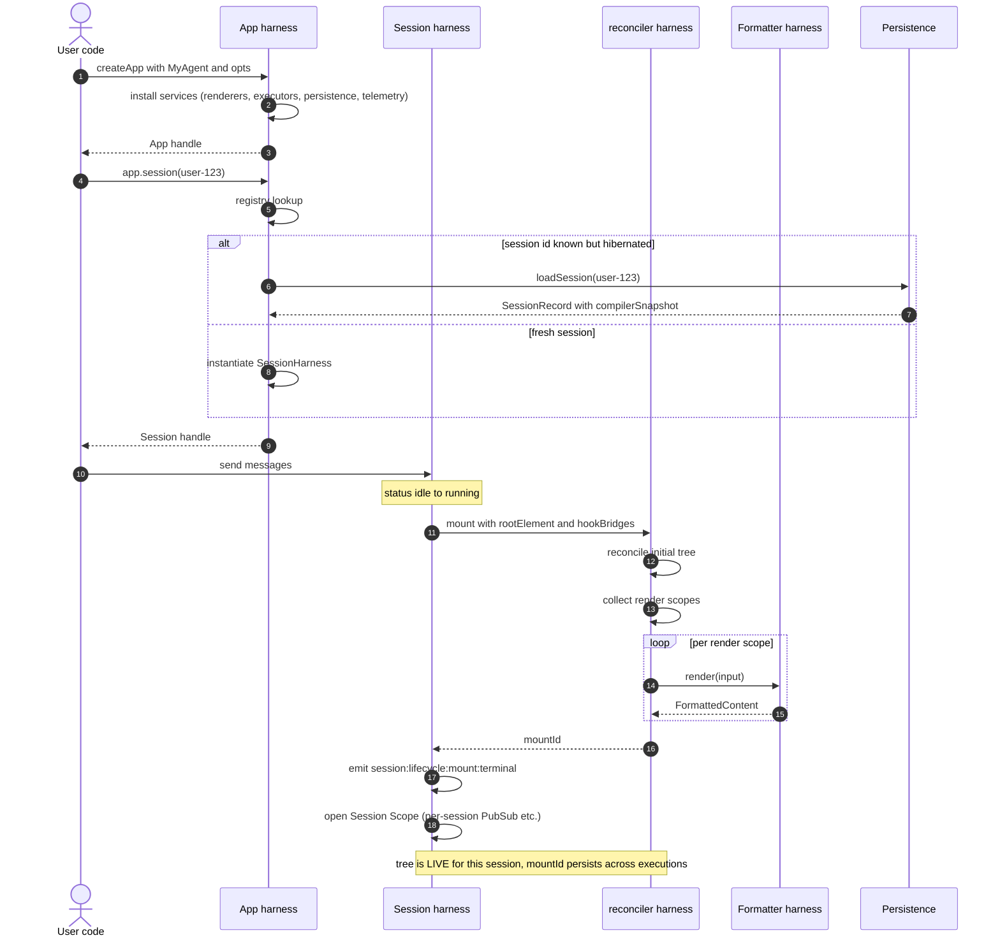
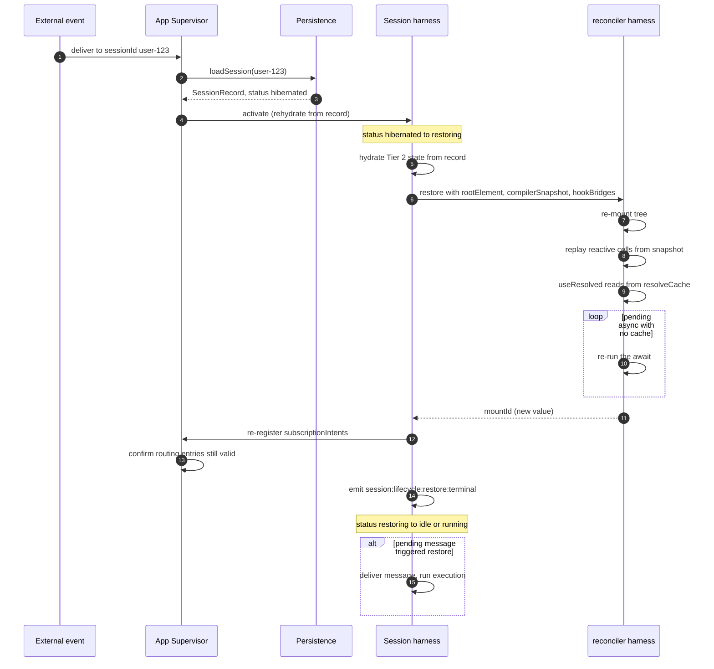
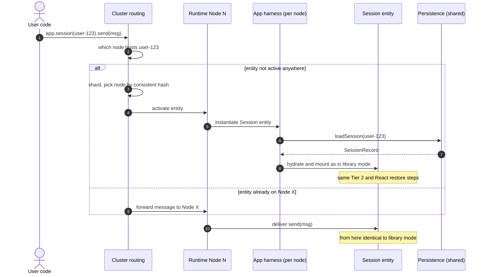

# Flow A — Cold Start and Mount

**Status:** Synthesized

The first time the runtime sees a session — either because user code
called `app.session(id)` for a new id, or because a hibernated session
is being activated by an arriving message — these are the things that
happen in order.

## Library mode (Tier 0/1)



The session harness ALWAYS mounts the React tree at session activation,
NOT per execution. The mountId stays valid across many `send` /
`dispatch` / `render` calls. It only goes away on hibernate or close.

## What "alive" means

Once mounted:

- `useState`/`useReducer`/`useSignal` cells are live; setters update them.
- `useEffect` and lifecycle hooks (`useOnMount`) have fired.
- Long-lived primitives (`<Subscription>`, `<Cron>`, `<Webhook>`,
  `<EventListener>`) have registered intents.
- Renderer providers are in scope.
- React Context (sandbox, MCP, custom) is bound.
- `useData` may have started loaders (suspended subtrees may be
  awaiting).

The tree exists independent of any execution. A `renderTree` call
takes a snapshot of the current tree state; it doesn't define when the
tree exists.

## Hibernated session: activation



Restoration order matters:

1. **Session record loaded first** — small, fast.
2. **Tier 2 state hydrated** — knobs, intents, resolveCache, channel
   pointers. All small structured data.
3. **reconciler harness restored** — the tree re-mounts, replays cells from
   the compiler snapshot, runs `useResolved` against the resolveCache.
   Async components without a cached resolve re-run their loaders.
4. **Subscription intents re-registered** with the supervisor. The
   supervisor's external connections (webhooks, cron timers) typically
   stayed alive while the session was hibernated, so this is a re-bind,
   not full re-materialization.

## Cluster mode



The cluster wrapper adds:

- Routing layer (consistent hash → node).
- Activation across nodes (one entity, one node at a time).
- Migration if the hosting node leaves.

User code is identical. The Session reference returned from
`app.session(id)` is a typed cluster entity reference in cluster mode
(commands go through the cluster's typed-message routing) and a direct
in-process object in library mode.

## Events emitted during cold start

Approximate sequence on a fresh session created via library `app.session(id)`:

```
app:session:created:terminal { sessionId }
session:lifecycle:mount:requested
session:lifecycle:mount:before
reconciler:mount:requested
reconciler:render:requested            (if renderTree was called for a first send)
reconciler:render:delta                (per stable-iteration)
reconciler:render:terminal             { iterations, forcedStable }
formatter:format:* (per scope)
reconciler:mount:terminal               { mountId, succeeded }
session:lifecycle:mount:terminal   { succeeded }
```

If the session is hibernated and being restored:

```
app:session:restored:terminal      { sessionId }
session:lifecycle:restore:requested
session:lifecycle:restore:before
reconciler:restore:requested
reconciler:restore:terminal             { mountId, succeeded }
session:subscription:registered:terminal × N (re-binds)
session:lifecycle:restore:terminal { succeeded }
```

## What can fail

| Failure | Where it surfaces |
| --- | --- |
| Persistence load timeout | `RestoreError` from session.restore |
| Compiler snapshot corrupt or wrong spec version | `RestoreError` with `cause: VersionMismatch` |
| Async component throws on re-run after restore | `reconciler:async:resolved` with `outcome: failed` → loop's `reconciler:render:terminal { failed }` |
| Subscription handler ID no longer in tree | `session:subscription:handler-unbound:terminal` per intent |
| Cluster node unavailable for activation | `cluster:activation:terminal { failed }` (then routing retries) |

## Cross-references

- `03-reconciler-harness.md` for `mount`, `restore`, `renderTree` details.
- `08-session-harness.md` for session lifecycle states.
- `11-cluster.md` for activation, supervisor, migration.
- `14-state-tiers.md` for what's in the snapshot vs what's hydrated
  separately.
