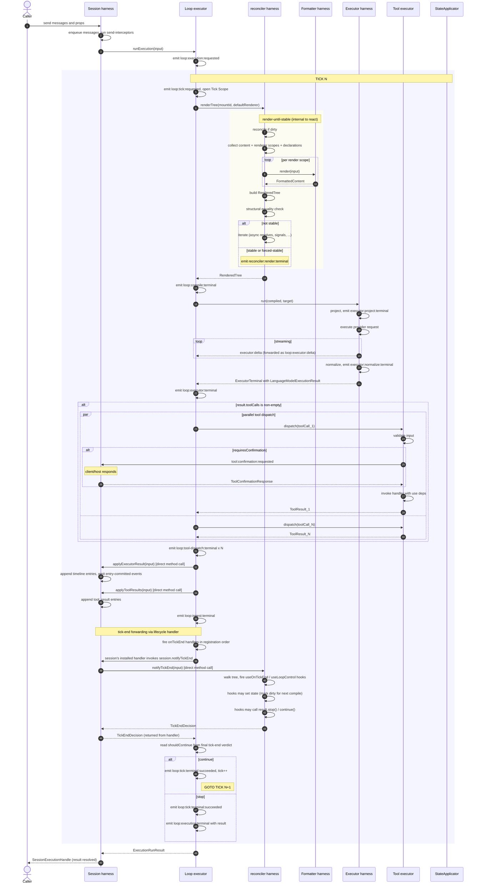

# Flow B — Tick and Tool Loop

**Status:** Synthesized

This is the **central** flow of v2: how a `session.send(...)` runs through
the harness stack and produces a `SendResult`. This flow shows the
dynamic relationship between the four runtime-side harnesses (session,
loop executor, reconciler harness, executor, tool executor) and clarifies the
"reconciler harness as a multi-phase executor running alongside the loop"
view.

## High-level shape

```
session.send(input)
  │
  ▼
┌─────────────────────────────────────────────────────────────────┐
│  Session harness                                                │
│    - serialized command lock                                    │
│    - Session Scope already open                                 │
│    - React tree already mounted (mountId from session start)    │
│    ├─► loop.runExecution(...)                                   │
│    │     │                                                      │
│    │     ▼                                                      │
│    │   per tick:                                                │
│    │     react.renderTree(mountId)  → RenderedTree     │
│    │     executor.run(compiled, target) → ExecutorTerminal      │
│    │     toolExecutor.dispatch × N      → ToolResult[]          │
│    │     stateApplicator.apply...       → mutates session state │
│    │     react.rerender(mountId)        → tree sees new state   │
│    │     continuationPolicy.shouldContinue                      │
│    │     ┌──────── continue: next tick                          │
│    │     └──────── stop: assemble result                        │
│    └─► SendResult                                               │
│                                                                 │
└─────────────────────────────────────────────────────────────────┘
```

Two harnesses run "alongside" each other:

- **reconciler harness** holds the live tree. It produces `RenderedTree`
  on demand (`renderTree`), re-renders against new state on demand
  (`rerender`), and accepts tick-end notifications that fire in-tree
  hooks (`notifyTickEnd`).
- **Loop executor** drives the tick cycle. It calls `renderTree`,
  executes, applies results to session state, fires its `onTickEnd`
  lifecycle handlers (which the session uses to forward to React), then
  decides next tick or stop based on the tree's verdict.

**Cross-harness coupling is loose.** The loop never imports the React
harness. The session is the integration site that wires
`loop.onTickEnd → session.notifyTickEnd → react.notifyTickEnd`. Direct
function references; in-process; fast. Events fire in parallel for
observation only.

State application is **direct method calls** from loop to session
(`session.applyExecutorResult`, `session.applyToolResults`), not
events. The loop has typed references to the session via the
StateApplicator narrowed Pick.

## Detailed per-tick sequence



## Step-by-step breakdown

### 1. Session entry

User calls `session.send(input)`. The session harness:

- Acquires the per-session command lock (sessions process commands
  serially).
- Runs `send`-scope interceptors (`before` phase). Veto / replace /
  defer apply here.
- Enqueues messages onto session state.
- Delegates to the loop executor with a freshly-created `executionId`.

### 2. Loop executor opens Execution Scope

Loop executor opens an Effect Scope nested inside the Session Scope.
All per-execution resources (the loop's fiber, tick-scoped Effects, tool
dispatch Scopes) live in this Scope. When the execution terminates
(naturally or via abort), the Scope ends and resources release.

Loop executor emits `loop:execution:requested` then `loop:execution:before`
(running execution-scope interceptors).

### 3. Per tick: renderTree

Loop calls `react.renderTree(mountId, defaultRenderer)`.

Inside the reconciler harness, **render-until-stable** runs:

1. If the tree is dirty (state changed since last compile), reconcile.
2. Collect content scopes (System/User/Section/etc.), renderer scopes,
   declarations (Tool/Output/MCP/Subscription).
3. For each renderable scope, call `renderer.render(input)` and embed
   the result.
4. Build the `RenderedTree`.
5. Compare to previous output (hash compare). If equal → emit. If
   iteration cap reached → emit with `forcedStable: true`. Otherwise
   continue iterating (async resolves, signal updates trigger another
   pass).

Returns `RenderedTree` to the loop.

### 4. Per tick: executor run

Loop calls `executor.run(compiled, target)`. Inside the executor:

- **Project**: IR → provider input. Emit `executor:project:terminal`.
- **Execute**: issue provider request, stream deltas as
  `executor:delta`.
- **Normalize**: provider output → `LanguageModelExecutionResult`. Emit
  `executor:normalize:terminal`.

Returns `ExecutorTerminal { outcome: "succeeded", result }`.

### 5. Per tick: tool dispatch

If `result.toolCalls` is non-empty, the loop dispatches each via the
tool executor. Parallel dispatch is the default for read-only tools (per
`ToolAnnotations.intent`), serialized otherwise.

Each dispatch:

- Validates input against tool's `inputSchema`.
- If `requiresConfirmation`, runs the confirmation flow through
  `session:tool_confirmation` channel.
- Resolves `use:` deps captured at last render time.
- Invokes the handler.
- Returns `ToolResult`.

Provider-side executed tools (Google grounding, OpenAI code interpreter)
are NOT in `result.toolCalls` — their results are already in
`result.output` as `tool_result` blocks. The loop never dispatches them.

### 6. Per tick: state application

The loop calls the StateApplicator:

- `applyExecutorResult(sessionId, result)` — appends timeline entries
  for the assistant message, tool_use blocks, and any provider-executed
  tool_result blocks. Emits per-entry `session:timeline:entry-committed:terminal`.
- `applyToolResults(sessionId, toolResults)` — appends tool_result
  entries from Agentick-dispatched tools.

Persistence backend writes happen here (incremental, one row per entry).

### 7. Per tick: rerender

Loop calls `react.rerender(mountId, trigger)`. The trigger is
`{ type: "external-event", payload: { newEntries: N } }` or similar.

The reconciler harness re-renders the tree. The tree's hooks
(`useTimeline()`, `useChannel(...)`, `useResolved(...)`, …) read the new
state via the runtime's hook bridges. Components that observed the new
entries re-render with updated content.

**Crucially, this rerender produces no new compiled output by itself.**
The next tick's `renderTree` is when the runtime takes a snapshot.
The rerender just updates the live tree so the next snapshot reflects
the ingested results.

This is the "indirect ingest" mechanism: state applies → tree re-renders
→ next compile sees the change.

### 8. Continuation decision

Loop calls `continuationPolicy.shouldContinue(ctx)` with the
post-ingest view. Default policy:

- `stopReason === "tool_use"` AND tool calls are pending → continue.
- `stopReason === "end"` → stop.
- `tick + 1 >= maxTicks` → stop.
- Otherwise → stop with the original stop reason.

Interceptors at `continuation` boundary may replace this decision.

### 9. Loop termination

Loop assembles `ExecutionRunResult`:

```
{
  executionId,
  ticks: N,
  usage: accumulated UsageStats,
  stopReason,
  output: terminal tick's result.output,
  outputs: collected from OutputDeclaration tools,
}
```

Emits `loop:execution:terminal { outcome: "succeeded", result }`. Closes
Execution Scope (releases tick-scoped resources).

Returns to session harness, which:

- Emits `session:execution:terminal { succeeded }`.
- Resolves the `SessionExecutionHandle.result` Promise with `SendResult`.

User sees the execution complete.

## Why two harnesses, not one

The natural question: why not collapse the loop executor into the React
harness, or vice versa?

```
Reason 1: reconciler harness must be browser-safe
  reconciler harness emits RenderedTree for many use cases:
    - JSX → markdown for documentation
    - JSX → MCP resource bodies
    - JSX → prompt previews in a browser tool
    - JSX → snapshot for tests
  None of these involve provider calls. The loop executor's tick loop
  has no business in these flows.

Reason 2: Loop executor must work without React
  In principle, an alternative compiler (Vue, Solid, an imperative DSL)
  could implement ReconcilerProtocol. The loop executor consumes
  RenderedTree only — it doesn't care which compiler produced it.

Reason 3: Different testing patterns
  Compile semantics test: compile a JSX tree, snapshot, check.
  Tick semantics test: provide RenderedTree fixture, run loop,
  check ExecutionRunResult.
  Splitting the harnesses lets each test suite mock the other.

Reason 4: Different lifetimes
  React tree mounts at session start, lives for the session.
  Loop executor instances are per execution.
  Sharing a lifetime would force one of them into the wrong shape.
```

## What runs concurrently

Inside the entity / session, while it's active:

```
Session fiber (the entity's main fiber)
  │
  ├─ Command processor (one command at a time)
  │   serializes send / dispatch / render / ...
  │
  ├─ reconciler harness (alongside, not under)
  │   tree is mounted, hooks live
  │   responds to renderTree, rerender, snapshot, restore commands
  │
  ├─ Per-session PubSub
  │   fanning events to subscribers; lazy
  │
  ├─ Active subscription handlers
  │   when supervisor delivers an external event, runs in this fiber
  │
  └─ Per execution (forked when send/dispatch arrives):
      Execution fiber (child of session fiber)
        ├─ Loop executor's tick loop
        ├─ Per tick: renderTree + executor.run + tool dispatches +
        │   state apply + rerender + continuation
        └─ Closes when execution terminates
```

The session fiber itself is single-threaded (one command at a time).
Multiple sends arriving during a running execution queue messages onto
the active execution; the same `SessionExecutionHandle` is returned.

The reconciler harness is "alongside" because:

- It's not a child fiber of the loop executor.
- It outlives any single execution.
- Its mountId is owned by the session, not the execution.
- Both the loop executor (during ticks) and external code (e.g.,
  documentation rendering) can call the reconciler harness.

## Streaming (terminal correctness)

A subscriber that watches `loop:executor:delta` events sees model output
incrementally. A subscriber that only watches `loop:execution:terminal`
sees the final result.

Per `06-executor-harness.md`:

> A consumer that ignores all deltas and only reads the terminal event
> SHOULD obtain a complete, correct ExecutionResult from
> payload.result.

This means: **streaming is for UX, not correctness.** Tools that just
need the final answer (test assertions, persistence, downstream
agents) read terminal only. UI clients render deltas progressively but
must verify against terminal.

## Mid-execution interaction

While an execution is running, the host can:

```
handle.queueMessage(message)
  ─► appended to session inbox
  ─► visible to next renderTree via useTimeline (windowed)
  ─► may extend the loop with more ticks if continuation policy decides

handle.submitToolResult(toolUseId, response)
  ─► resolves a pending tool confirmation
  ─► tool executor's confirmation flow continues

handle.abort(reason)
  ─► sets the execution's AbortSignal
  ─► current tick aborts at next checkpoint
  ─► ExecutorTerminal { outcome: "canceled" } bubbles up
  ─► loop:execution:terminal { canceled } emitted
```

All three are routed through the session's command lock; they don't
race the running execution.

## Failure paths in a tick

Where errors can happen and what they look like:

| Phase                | Failure                 | Outcome                                                                                                        |
| -------------------- | ----------------------- | -------------------------------------------------------------------------------------------------------------- |
| `renderTree`         | async component throws  | `reconciler:render:terminal { failed }` → `loop:tick:terminal { failed }` → `TickError { phase: "compile" }`   |
| `renderTree`         | iteration cap exceeded  | `reconciler:render:terminal { succeeded, forcedStable: true }`; loop continues                                 |
| executor `project`   | unsupported feature     | `executor:project:terminal { failed }` → `ProjectionError`                                                     |
| executor `execute`   | provider 5xx            | `executor:request:terminal { failed }` → `ProviderError`                                                       |
| executor `normalize` | malformed response      | `executor:normalize:terminal { failed }` → `NormalizationError`                                                |
| tool dispatch        | validation issue        | `tool:validation:terminal { failed }` → `ToolValidationError`; loop continues with that tool's result as error |
| tool dispatch        | handler throws          | `tool:handler:errored` → `ToolHandlerError`; same                                                              |
| tool confirmation    | denied                  | `tool:confirmation:resolved { approved: false }` → `ToolConfirmationDeniedError`                               |
| state apply          | persistence write fails | `loop:ingest:terminal { failed }` → `TickError { phase: "ingest" }`                                            |
| continuation         | policy throws           | rare; surfaces as `TickError { phase: "continuation" }`                                                        |

A tick-level failure terminates the execution by default unless an
interceptor handles it.

## Cross-references

- `03-reconciler-harness.md` — `mount`, `renderTree`, `rerender` details.
- `05-loop-executor.md` — algorithm, continuation policy, state
  applicator.
- `06-executor-harness.md` — three phases, terminal correctness.
- `07-tool-executor.md` — dispatch, confirmation, two doors.
- `08-session-harness.md` — command lock, lifecycle, session events.
- `10-events-and-interceptors.md` — full event taxonomy.
