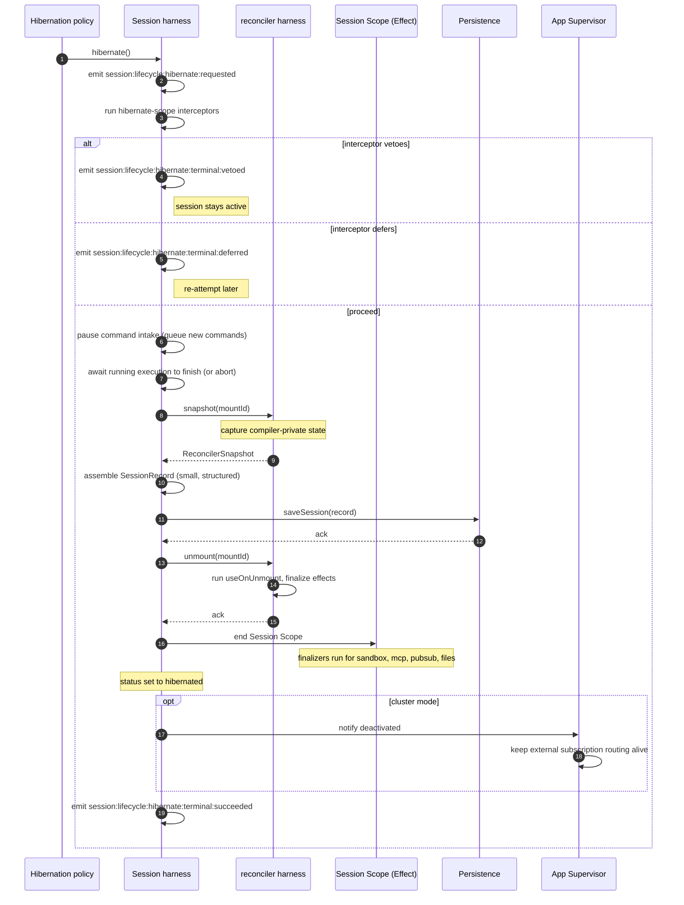
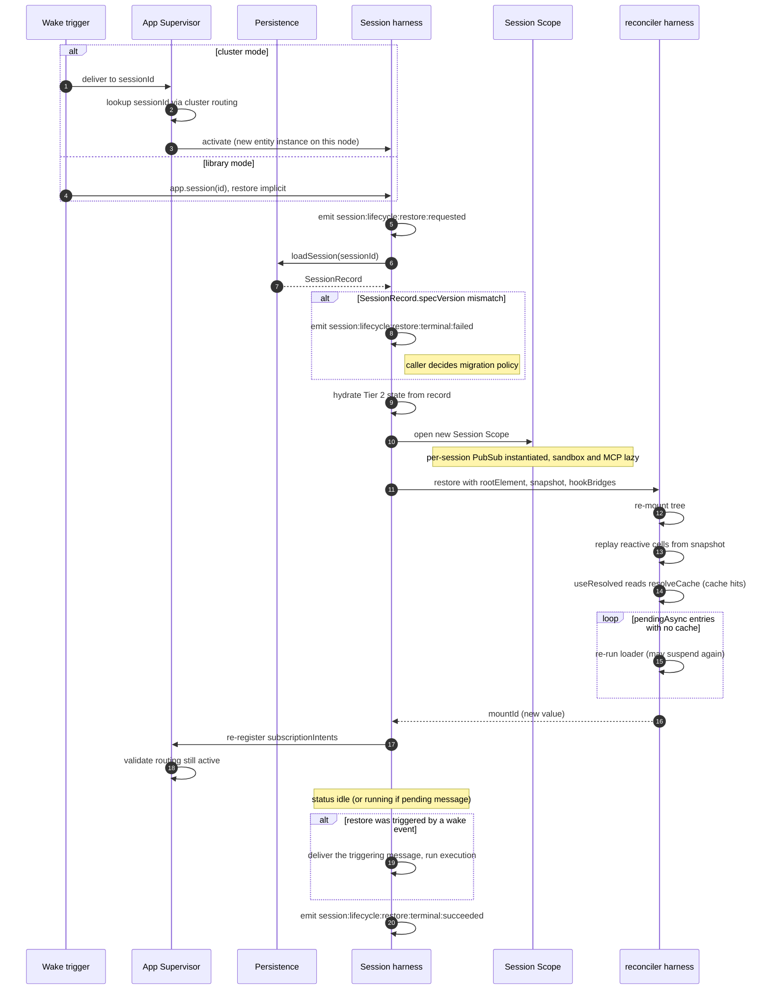

# Flow C — Hibernate and Restore

**Status:** Synthesized

How a session goes from active to hibernated, and how it comes back.

## Why hibernate

Active sessions hold real resources:

- Mounted React tree (memory).
- Sandbox connection (Docker container, bwrap process, …).
- MCP client connections.
- Per-session PubSub buffers.
- In-flight async loaders.

For long-tailed multi-session deployments (chat platforms, agent fleets,
scheduled workers), most sessions are idle most of the time. Holding
their resources resident is wasteful. Hibernation **drops those
resources** while preserving the session's identity, timeline, and
intent.

A hibernated session can be re-activated transparently: an arriving
message, a webhook delivery, a cron fire — any of these wake the session
up and bring it back online.

## What survives hibernation, what doesn't

```
Survives (persisted):                  Released (re-created on restore):
─────────────────────                  ──────────────────────────────────
SessionRecord                          mounted React tree
  ─ identity                           sandbox connection
  ─ status, currentTick                MCP client connections
  ─ knobs                              in-flight provider streams
  ─ subscriptionIntents                per-session PubSub
  ─ resolveCache                       active subscription receivers
  ─ channelPointers                    open file handles
  ─ usage                              loop executor's per-execution Scope
  ─ compilerSnapshot                   tool dispatch Scopes (none should be
                                        in flight at hibernate time)

Timeline entries (persisted incrementally; not part of the snapshot)
Channel events (persisted per retention policy)
Large content (persisted by reference)
```

## Hibernate sequence



### Critical region handling

```
Interceptor pattern:

  app.use({
    name: "no-hibernate-during-payment",
    install: (ctx) => {
      ctx.interceptors.register({
        query: { name: { exact: "session:lifecycle:hibernate" }, phase: "before" },
        scope: { scope: "session" },
        handler: async (event, next) => {
          if (paymentInFlight()) {
            return { kind: "veto", reason: "payment in flight" };
          }
          return { kind: "proceed" };
        },
      });
    },
  });

Or for graceful flushes:

  return { kind: "defer", retryAfter: 30000 };

The hibernation policy will re-attempt after the retryAfter.
```

### What about in-flight async work?

When a hibernate is initiated:

- **No active execution**: clean. Snapshot, unmount, scope-end.
- **Active execution**: by default, the hibernate command DEFERS until
  the execution completes (interceptor lean). A forced hibernate
  (e.g., shutdown) ABORTS the execution first, captures whatever
  partial state, then proceeds.
- **Suspended async component**: the in-flight Promise is canceled (via
  AbortSignal-aware cancellation). The compiler snapshot records
  the component as `pendingAsync`. On restore, the component re-runs
  its loader from scratch. Document that **a raw `await` may run twice**
  across hibernate.
- **`useData` mid-resolve**: same as above. Use `useData` with
  `persist: true` to opt into Layer-1 caching that survives hibernate.

`[GAP]` — the abort-on-forced policy details. Sign-off needed.

## Restore sequence



## Triggers that wake a hibernated session

```
1. Direct user/host call:
     await app.session("user-123").send({ messages });
     ─► routing finds the entity hibernated, activates, delivers send.

2. Subscription event:
     The supervisor receives an event (webhook delivery, MQ message,
     cron fire) bound to a subscriptionIntent.
     ─► routes to sessionId, activates, delivers.

3. Channel publish from another session:
     session.channel("cross-session-bus").publish(msg)
     ─► if the other session subscribed to that channel, supervisor
        wakes it.

4. Explicit restore:
     await app.session("user-123").restore();
     ─► forces activation without delivering anything.
```

## Persistence backend involvement

```
Session record   ──► single row update on hibernate
                     single row read on restore
                     small (typically <10 KB)

Timeline         ──► already persisted incrementally during execution;
                     hibernate does NOT touch the timeline
                     restore loads a window per useTimeline queries

Channel events   ──► already in channel storage (Tier 4)
                     hibernate does NOT touch
                     restore reads pointer state from session record;
                     events read on subscribe

Compiler snapshot ─► embedded in session record
                     small (per-component cells, no fiber tree)
```

This is what makes hibernation cheap: the only write at hibernate time
is the session record (one row, small). Timeline writes happen
incrementally during execution; hibernate doesn't dump anything.

## Restore failure modes

| Failure                                   | Behavior                                                                                                    |
| ----------------------------------------- | ----------------------------------------------------------------------------------------------------------- |
| Session record missing                    | New session creation (if id was provided as fresh) or `SessionNotFoundError`                                |
| Compiler snapshot missing                 | Fresh re-mount as if first activation; `useResolved` reads return undefined                                 |
| Spec version mismatch                     | `RestoreError { cause: VersionMismatch }`; caller decides migration policy                                  |
| Async component throws on re-run          | `reconciler:async:resolved { failed }`; tree compiles with that subtree errored                             |
| Subscription handler ID no longer in tree | `session:subscription:handler-unbound:terminal` per intent; supervisor applies miss policy (drop / requeue) |
| Sandbox provider can't reconnect          | First tool dispatch that needs sandbox throws; tree may render an error component if it has one             |
| Persistence load timeout                  | `RestoreError`; cluster may retry on another node                                                           |

## Hibernation policies

The hibernation policy decides **when** to hibernate. Common choices:

```
Idle threshold:
  hibernate after N minutes of no commands AND no streaming subscribers

Memory pressure:
  hibernate eligible sessions when active count exceeds threshold

Explicit pin / unpin:
  app.session(id).pin()    // never hibernate while pinned
  app.session(id).unpin()  // restore default policy

LRU eviction:
  if active count exceeds limit, hibernate the least-recently-used
```

`[GAP]` `[SOURCE: runtime.md (earlier) §Open Question 6]` — defaults.
Blueprint position `[PROPOSAL]`:

```
default idle threshold: 15 minutes
default LRU active-count cap: max(N_cores * 32, 256)
default forced abort timeout: 5 seconds (then hard-abort)
```

Sign-off needed.

## Cluster-mode specifics

In cluster mode:

- The **supervisor** singleton is what holds external connections
  (webhooks, cron timers, MQ subscriptions). It outlives any individual
  session activation. This is what makes aggressive hibernation viable.
- **Session entities deactivate** via the cluster framework's entity
  lifecycle. The framework handles routing arriving messages to the
  newly-activated entity (possibly on a different node).
- **Migration during hibernation**: a hibernated session's "node" is
  effectively the persistence backend. There is no node-bound state
  while hibernated. Re-activation picks any node by sharding rule.

## Test strategies

```
Hibernate / restore round-trip test:
  1. Run a session through one execution.
  2. session.hibernate().
  3. Verify session record + compiler snapshot in test persistence.
  4. session.restore().
  5. Run another execution; assert state is preserved (timeline, knobs).

Forced abort during execution:
  1. Start session.send(...).
  2. Mid-tick, call session.hibernate().
  3. Verify deferral (default) or abort (forced).
  4. Resume and check state.

Subscription survival:
  1. Mount <Subscription handlerId="orders" />.
  2. Hibernate.
  3. Send event to source.
  4. Verify session re-activates and handler runs.

Spec version migration:
  1. Save record with old spec version.
  2. Restore.
  3. Verify migration hook ran (or expected error).
```

## Cross-references

- `03-reconciler-harness.md` — `snapshot`, `restore`, `unmount` commands.
- `08-session-harness.md` — lifecycle states, hibernate command,
  interceptors.
- `11-cluster.md` — supervisor, entity activation/deactivation.
- `14-state-tiers.md` — what's in the snapshot vs persisted separately.
