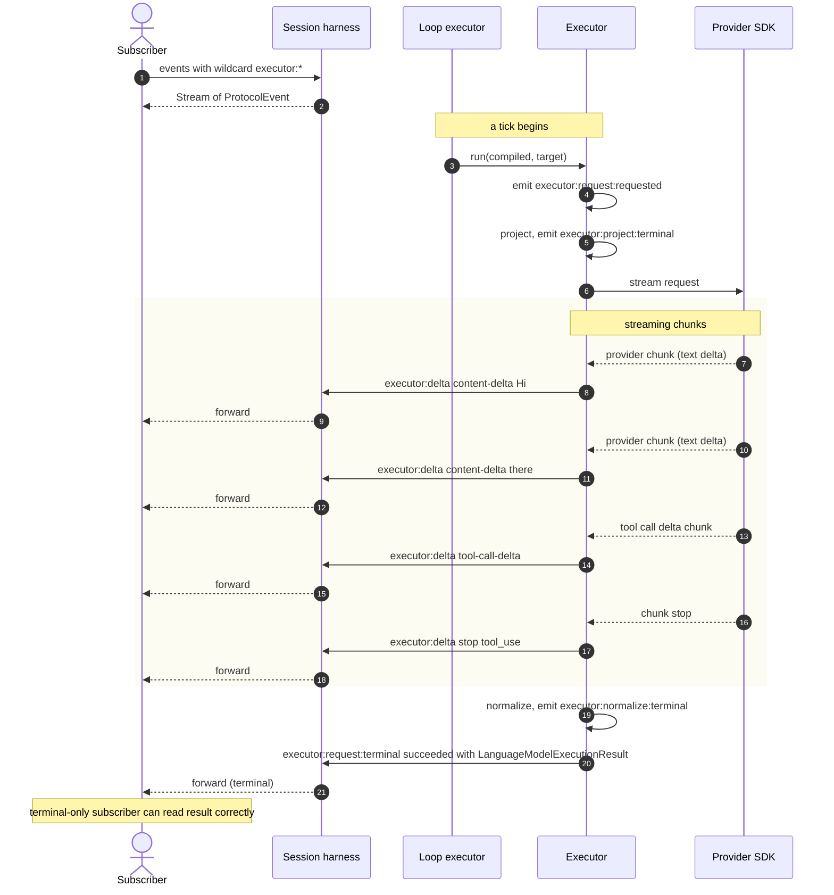

# Flow D — Streaming and Terminal

**Status:** Synthesized

How model output streams from the executor through the loop and session
to subscribers, and the **terminal correctness invariant** that lets
subscribers choose delta vs terminal-only without losing correctness.

## The four event "altitudes"

```
                   SUBSCRIBER ATTACHES AT...
                          │
   ┌──────────────────────┼──────────────────────┐
   │                      │                      │
   ▼                      ▼                      ▼
Executor               Loop                   Session
events                 events                 events
(executor:*)           (loop:*)               (session:*)
─ raw deltas           ─ tick-shaped          ─ session-shaped
─ project/normalize    ─ multi-tick aware     ─ life cycle aware
─ provider chunks      ─ continuation         ─ timeline-committed
─ tool-call-detected   ─ ingestion             ─ auth-aware
─ (high cadence)       ─ (medium cadence)     ─ (low cadence)
                                                 ─ filtered cross-session
                                                 ─ tagged with sessionId
```

Plus an outer ring:

```
App-level events  (app:cross-session:*)
─ same envelopes, fan-up from sessions
─ multi-session observability
```

A subscriber chooses **altitude based on use case**:

| Use case | Altitude |
| --- | --- |
| Render token-by-token in UI | executor or loop deltas |
| Trace a single agent run for debugging | loop terminals |
| Audit log of all session activity | session terminals |
| Multi-tenant observability dashboard | app cross-session |
| DevTools recording with provider raw | DevTools bus |

## Terminal correctness invariant

Per `06-executor-harness.md`:

> A consumer that ignores all deltas and only reads the terminal event
> SHOULD obtain a complete, correct ExecutionResult from
> payload.result.

This means streaming is **for UX, not correctness**. Tools that just
need the final answer can subscribe only to `*:terminal:succeeded`
events with `payload.result`; clients that render progressively read
deltas but cross-check with terminals.

The invariant applies at every altitude:

```
executor:request:terminal { succeeded }      → ExecutionResult
loop:execution:terminal { succeeded }        → ExecutionRunResult
session:execution:terminal { succeeded }     → SendResult
```

## Streaming sequence



## Loop-level event re-tagging

Per-tick events flow up the harness stack with envelope re-tagging:

```
Originating harness                     As consumed by session subscribers
───────────────────                     ───────────────────────────────────
executor:project:terminal               loop:executor:project:terminal
                                        session:execution:executor:project:terminal*

executor:delta                          loop:executor:delta
                                        session:execution:executor:delta

executor:request:terminal               loop:executor:terminal
                                        session:execution:terminal (when last tick)

tool:dispatch:terminal                  loop:tool-dispatch:terminal
                                        session:execution:tool-dispatch:terminal

reconciler:render:terminal                  loop:compile:terminal
                                        session:execution:compile:terminal
```

`*` wrapper conventions are `[GAP]` per `01-harness-principle.md` open
questions; the simplest is "session re-emits with `scope.sessionId`
populated and `tags: ['wrapped-by:session']`, name unchanged."

The blueprint position is to keep names from the originating harness so
filters remain composable, and rely on `surface` and `scope.sessionId`
for context.

## Subscriber ergonomics

```ts
// All deltas (any surface, any tick)
session.events({ phase: "delta" });

// Terminal events for executor only
session.events({
  surface: "executor",
  phase: "terminal",
});

// Failed outcomes anywhere
session.events({
  phase: "terminal",
  outcome: ["failed", "vetoed", "canceled"],
});

// One specific tick's lifecycle
session.events({
  scope: { tickId: "tick-42" },
});

// App-wide: all tool dispatches across all sessions
app.events({
  surface: "tool",
  name: { prefix: "tool:dispatch" },
});

// DevTools bus (separate stream, same envelope)
app.devTools.events({ scope: { sessionId } });
```

## Backpressure during streaming

The streaming path is the most likely to hit backpressure (high event
rate). Per `10-events-and-interceptors.md`:

```
Per-subscriber bounded buffer (default 256).
Slow subscriber: buffer fills → stream pauses for that subscriber only.
If buffer overflows: subscriber's stream errors with BufferOverflowError;
    other subscribers unaffected; publisher continues.

Lazy fan-out: if no executor-delta subscribers exist, executor delta
events are not constructed. Cost when no listeners: zero.
```

For UI clients sometimes affected by tab-throttling or network stalls,
the recommended pattern is:

```
1. Subscribe to deltas for progressive rendering.
2. Reconcile against the terminal payload when it arrives.
3. If you missed deltas (BufferOverflowError or transport drop),
   the terminal still gives you the complete state.
```

## Ordering guarantees

Per session, events are **strictly ordered** by sequence number
(`[V1-INHERITED]`). Within a tick:

```
loop:tick:requested → loop:tick:before → loop:compile:* (delta+) →
loop:compile:terminal → loop:executor:requested → loop:executor:* (delta+) →
loop:executor:terminal → loop:tool-dispatch:* (per call, may be parallel) →
loop:ingest:terminal → loop:continuation:terminal → loop:tick:terminal
```

Tool dispatches in parallel are interleaved by call (each call's events
are ordered, but interleaving across calls reflects actual scheduling).

Cross-session ordering is best-effort (`[GAP]` cluster open question).

## Resume across reconnect

When a streaming subscriber disconnects (network drop, tab close,
gateway restart) and reconnects:

```
1. Client sends lastSeenSequence.
2. Gateway looks up the session's per-session buffer.
3. If lastSeenSequence is in buffer:
     replay from lastSeenSequence + 1
4. If older than buffer:
     ResumeWindowExceededError
     client must full-resync: fetch current state,
     subscribe from "latest"
```

`[V1-INHERITED]` from existing sequence-number resume mechanism.
Per-session buffer defaults at gateway level (256 events / 5 minutes per
`12-gateway.md`).

## Terminal-only consumers

For pure correctness consumers (test assertions, persistence, agent
chains):

```ts
const result = await session.send({ messages }).result;
// Promise<SendResult>; ignores all delta events; correct.

// Or via events:
const terminal = await firstValueFrom(
  session.events({
    name: { exact: "session:execution:terminal" },
    outcome: "succeeded",
  })
);
// terminal.payload is SendResult (or ExecutionRunResult inside session
// terminal — see envelope payload table below)
```

## Terminal payload table

| Event | Phase | Payload on succeeded |
| --- | --- | --- |
| `executor:request:terminal` | terminal | `LanguageModelExecutionResult` |
| `executor:normalize:terminal` | terminal | `LanguageModelExecutionResult` |
| `loop:tick:terminal` | terminal | `{ tick, shouldContinue, usage }` |
| `loop:execution:terminal` | terminal | `ExecutionRunResult` |
| `tool:dispatch:terminal` | terminal | `ToolResult` |
| `session:execution:terminal` | terminal | `SendResult` |
| `reconciler:render:terminal` | terminal | `{ iterations, forcedStable, compiled }` |
| `reconciler:render-to-string:terminal` | terminal | `FormattedContent` |
| `formatter:format:terminal` | terminal | `FormatResult` |

On `failed`, payload is `error: ProtocolError`. On `canceled`, payload
includes optional `reason`. On `vetoed`, payload includes `reason`. On
`replaced`, payload includes the replacement result and optional
`reason`.

## Event delta payloads

| Delta event | Payload shape |
| --- | --- |
| `executor:delta { kind: "content-delta" }` | `{ blockIndex, delta: string }` |
| `executor:delta { kind: "tool-call-delta" }` | `{ toolCallId, blockIndex, delta: string }` |
| `executor:delta { kind: "reasoning-delta" }` | `{ blockIndex, delta: string }` |
| `executor:delta { kind: "content-block" }` | `{ blockIndex, block: ContentBlock }` |
| `executor:delta { kind: "usage" }` | `{ usage: Partial<UsageStats> }` |
| `executor:delta { kind: "stop" }` | `{ stopReason: LanguageModelStopReason }` |
| `reconciler:render:delta` | `{ iteration }` |
| `formatter:format:delta` | implementation-specific |

`[PROPOSAL]` shapes (carried from `02-data-model.md` and
`06-executor-harness.md`); sign-off needed.

## Cross-references

- `06-executor-harness.md` — three-phase model and terminal
  correctness.
- `10-events-and-interceptors.md` — full event taxonomy.
- `12-gateway.md` — resume buffer at the transport boundary.
- `14-state-tiers.md` — channel retention.
