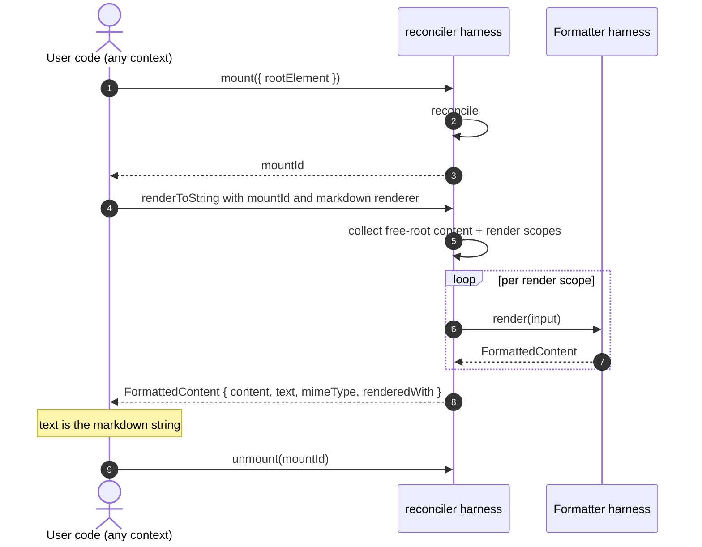
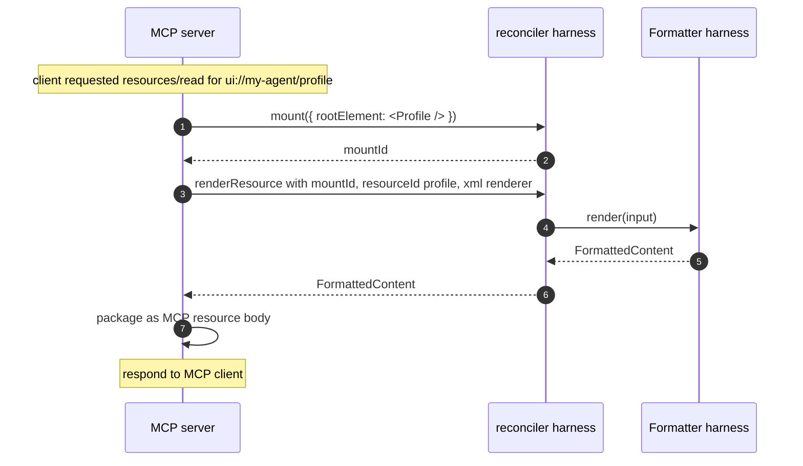
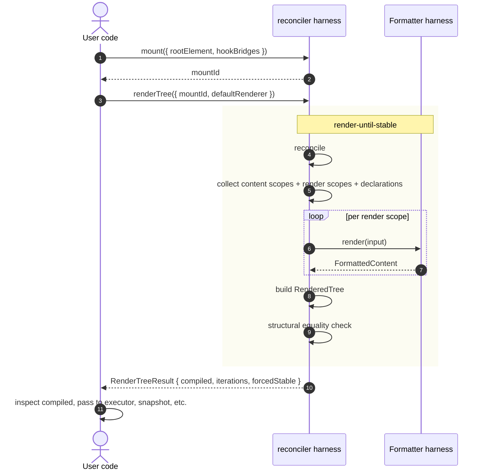

# Flow E — Resource Render (no loop, no executor)

**Status:** Synthesized

The reconciler harness emits multiple artifacts. Some flows do **not** involve
the loop executor or the executor harness at all. These are the "Level 1"
and "Level 2" use cases from `03-reconciler-harness.md`:

```
Level 1: JSX → rendered string/resource (markdown, XML, MCP resource body)
Level 2: JSX → RenderedTree (inspection, snapshot, custom executor)
Level 3: JSX → RenderedTree → loop executor → SendResult (the agent loop)
```

Flows A–D covered Level 3. This flow covers Levels 1 and 2.

## Why this matters

A common v1 mistake is to assume "compile" only happens during agent
execution. v2 makes the distinction explicit:

- **The reconciler harness is a living application** that can produce many
  artifacts.
- **The loop executor + executor harness are agent-loop concerns** and
  optional.
- **Pure rendering** (docs, MCP resources, prompt previews) doesn't need
  them.

This is what makes `@agentick/react` browser-safe and reusable in
non-runtime contexts.

## Level 1: JSX → markdown resource



Use cases:

- Documentation generation: render a JSX-described agent prompt as
  markdown for the docs site.
- MCP resource body: render the agent's "what I know" context as a
  markdown resource that another agent can read.
- Prompt previews in dev tools.
- Test fixtures: snapshot markdown output.

No loop executor, no executor harness, no provider call. Just React
harness + formatter harness.

## Level 1 variant: MCP resource



The MCP server is a separate framework package
(`@agentick/mcp`). It uses the reconciler harness as a library. No agent loop.

## Level 2: JSX → RenderedTree



Use cases:

- Tests that assert the agent compiled a specific context.
- Custom executors that don't fit `LanguageModelExecutor` (image gen,
  retrieval, evaluation rigs).
- Pre-execution audits (privacy scrubbers checking what would be sent).

The runtime's loop executor uses this same command per tick — but at
Level 2 the user calls it directly without a loop wrapper.

## Hook bridges in non-runtime contexts

The reconciler harness's hooks bridge to runtime-supplied state. In Level 1
and Level 2 contexts (no full runtime), the user provides minimal
bridges:

```ts
const stubBridges: HookBridges = {
  readTimeline: () => [], // empty timeline; pure render
  appendTimeline: () => {},
  getKnob: () => undefined,
  setKnob: () => {},
  registerKnob: () => {},
  readChannel: () => [],
  publishChannel: () => {},
  subscribeChannel: () => () => {},
  resolveOnce: async (_, loader) => loader(),
  readResolved: () => undefined,
  registerSubscription: () => {},
  registerResource: () => {},
};

const result = await reactHarness.renderToString({
  mountId,
  renderer: { id: "markdown" },
  hookBridges: stubBridges,
});
```

Or use `@agentick/react-hooks`'s pre-built stub bridges.

`[PLACEHOLDER]` — exact stub-bridge package shape; sign-off needed.

## Level 2: tests that mock everything below

```ts
import { mountForTest, MockExecutor, MockToolExecutor } from "@agentick/runtime-next/testing";

const test = mountForTest(<MyAgent />, {
  executors: { language-model: new MockExecutor([
    { output: [{ type: "text", text: "Hello!" }], stopReason: "end" },
  ])},
  toolExecutor: new MockToolExecutor({
    "search": async () => [{ type: "text", text: "found 12 results" }],
  }),
});

await test.send({ messages: [/* ... */] });
expect(test.timeline()).toMatchSnapshot();
expect(test.compiledStructure()).toMatchSnapshot();
expect(test.toolCalls("search")).toHaveLength(2);
expect(test.events({ name: { exact: "tool:dispatch:terminal" } })).toHaveLength(2);
```

`[V1-INHERITED, REFINED]` from existing `renderApp` test API in
`@agentick/core/testing`. v2 cleaner because every layer is mockable
through the harness boundary.

## Why Level 1 / Level 2 are first-class

`[SOURCE: compiler-harness.md §Levels of Usage]`:

> Each level builds on the previous one. The agent loop is not required
> to use the compiler/renderer.

This is what makes the reconciler harness reusable for:

- MCP resource servers that don't run agents.
- Build-time documentation generation.
- Static prompt analysis tools.
- Storybook-style component galleries for agent UI authors.
- Test rigs that compare compiled structures across versions.

## Composition note

```
reconciler harness  ──► used by:
                    ─ loop executor (Level 3)
                    ─ MCP server (Level 1)
                    ─ test infrastructure (Level 2)
                    ─ devtools recording (Level 2)
                    ─ docs generators (Level 1)

Formatter harness ──► used by:
                    ─ reconciler harness during compile (Level 1+2+3)
                    ─ reconciler harness during renderToString (Level 1)
                    ─ direct callers without React (e.g., bulk content
                      transformation tools)
```

The formatter harness can even be used **without** the reconciler harness:
take a `FormattableContent[]` array constructed programmatically, call
`rendererHarness.render(input)`, get `FormatResult`. Useful for content
transformation pipelines.

## Cross-references

- `03-reconciler-harness.md` — `mount`, `renderTree`, `renderToString`,
  `renderResource`.
- `04-formatters.md` — direct formatter use (pure functions).
- `13-package-graph.md` — what `@agentick/react` and
  `@agentick/react-hooks` ship.
